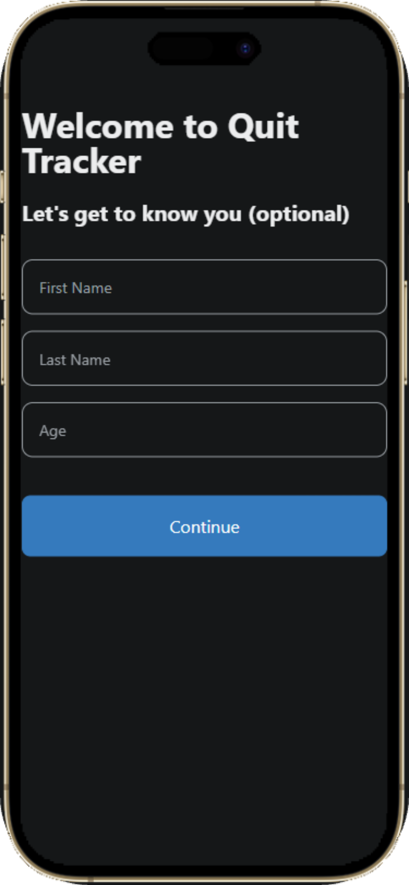
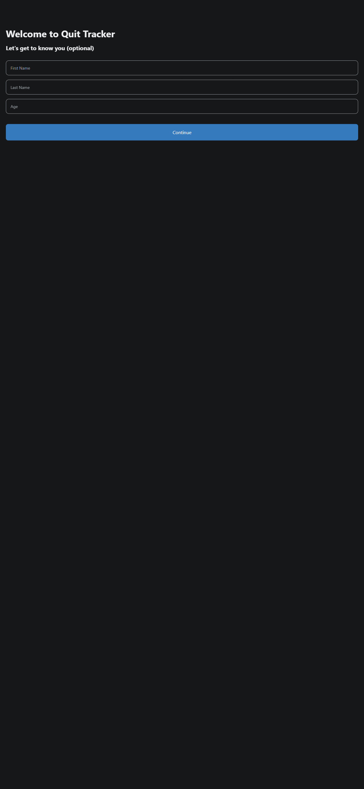
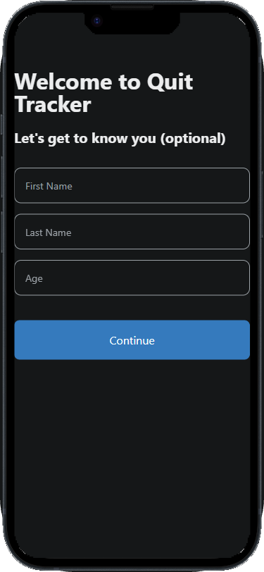

# 📱 Expo Screenshotter

<div align="center">

[](https://www.npmjs.com/package/expo-screenshotter)
[](https://github.com/TheRealPerson98/expo-screenshotter/blob/main/LICENSE)
[](https://github.com/TheRealPerson98/expo-screenshotter/issues)
[](https://github.com/TheRealPerson98/expo-screenshotter/actions)

</div>

<p align="center">
  <b>A command-line tool for automatically taking screenshots of Expo web apps at different screen sizes.</b><br>
  Perfect for generating marketing materials, documentation, or testing responsive designs.
</p>

<div align="center">
  
</div>

---

## ✨ Features

<table>
  <tr>
    <td>
      <ul>
        <li>📏 Take screenshots at predefined or custom screen sizes</li>
        <li>📜 Support for scrolling to capture full-page screenshots</li>
        <li>⏱️ Configurable delay to ensure content is fully loaded</li>
        <li>📁 Customizable output directory</li>
        <li>🔄 Batch screenshot multiple URLs</li>
      </ul>
    </td>
    <td>
      <ul>
        <li>🖼️ Supports custom viewport configurations</li>
        <li>📱 Place screenshots inside device frames (iPhone or Android)</li>
        <li>🎨 Multiple iPhone frame styles (pill or notch) and colors</li>
        <li>🤖 Android frames in different sizes (compact or medium) and colors</li>
        <li>🖱️ Interactive mode - type text, click buttons, and wait before taking screenshots</li>
        <li>🔍 Enhanced route detection for Expo Router projects with interactive selection</li>
      </ul>
    </td>
  </tr>
</table>

> **Note:** Device framing is fully implemented for both iPhone and Android frames. The tool will take your screenshot and overlay the device frame on top of it, maintaining the screenshot's dimensions.

---

## 🆕 What's New in v0.3.0

- **Interactive Route Selection**: Choose routes using a checkbox interface with arrow keys and space bar
- **Improved Expo Router Detection**: Better detection of routes in Expo Router projects, including tab navigation and dynamic routes
- **Simplified Route Selection Flow**: Three clear options for route selection:
  - Select specific routes interactively
  - Use all detected routes
  - Use default routes
- **Enhanced Tab Route Detection**: Automatically detects tab routes from Expo Router tab layouts

---

## 🚀 Installation

```bash
npm install -g expo-screenshotter
```

---

## 🖼️ Device Frame Assets

To use the device frame feature, you need to have the frame images in the correct location.

<details>
<summary><b>iPhone Frames</b></summary>
<p>
The tool looks for iPhone frame images in the <code>src/assets/iphones</code> directory with this naming convention:

- `Pill=true, Color=Space Black.png`
- `Pill=true, Color=Gold.png`
- `Pill=true, Color=Silver.png`
- `Pill=true, Color=Deep Purple.png`
- `Pill=False, Color=Starlight.png`
- `Pill=False, Color=Midnight.png`
- `Pill=False, Color=Red.png`
- `Pill=False, Color=Blue.png`
</p>
</details>

<details>
<summary><b>Android Frames</b></summary>
<p>
The tool looks for Android frame images in the <code>src/assets/android</code> directory with this naming convention:

- `Android Compact Black.png`
- `Android Compact Silver.png`
- `Android Medium Black.png`
- `Android Medium Silver.png`
</p>
</details>

If you're using this tool as a dependency in your project, you may need to create the appropriate asset directories and add the frame images manually.

---

## 📋 Usage

There are two main commands:

### Initialize Configuration

```bash
expo-screenshotter init
```

This creates a default `expo-screenshotter.json` configuration file in your project. You can then customize this file for your needs.

If you're using Expo Router, the tool will detect it and offer to automatically scan your project for routes:

```
Do you want us to automatically detect all routes for you? (Y/n):
```

If you select yes, the tool will:
1. Scan your `app` or `src/app` directory for route files
2. Detect routes based on Expo Router conventions (including route groups with parentheses)
3. Show you the detected routes and present an interactive menu with three options:
   - **Select specific routes interactively**: Opens a checkbox interface where you can use arrow keys to navigate, space to select routes, and enter to confirm
   - **Use all detected routes**: Includes all detected routes in your configuration
   - **Use default routes**: Uses the default example routes instead

This makes it much easier to get started with complex Expo Router projects!

### Take Screenshots

```bash
expo-screenshotter capture
```

This will use your `expo-screenshotter.json` configuration to take screenshots. Make sure your Expo web app is running first with `expo start --web`.

---

## ⚙️ Configuration File (expo-screenshotter.json)

The configuration file controls which routes to screenshot, at what sizes, and with what options. You can create this file manually or use the `init` command, which can automatically detect routes in Expo Router projects.

<details>
<summary><b>Click to view example configuration</b></summary>

```json
{
  "views": [
    {
      "name": "Home",
      "path": "/"
    },
    {
      "name": "Form with Input",
      "path": "/form",
      "interactions": [
        {
          "type": "type",
          "selector": "input[placeholder=\"First Name\"]",
          "text": "John"
        },
        {
          "type": "wait",
          "waitTime": 500
        },
        {
          "type": "type",
          "selector": "input[placeholder=\"Last Name\"]",
          "text": "Doe"
        },
        {
          "type": "wait",
          "waitTime": 1000
        }
      ],
      "waitAfterInteractions": 1000
    },
    {
      "name": "Button Click",
      "path": "/buttons",
      "interactions": [
        {
          "type": "click",
          "selector": "button.primary-button"
        },
        {
          "type": "wait",
          "waitTime": 2000
        }
      ],
      "waitAfterInteractions": 1000
    }
  ],
  "sizes": [
    {
      "width": 375,
      "height": 812,
      "name": "iPhone X"
    },
    {
      "width": 1280,
      "height": 800,
      "name": "Tablet"
    },
    {
      "width": 2560,
      "height": 1440,
      "name": "Desktop"
    },
    {
      "width": 1280,
      "height": 800,
      "name": "Tablet Full Page",
      "fullPage": true
    },
    {
      "width": 375,
      "height": 812,
      "name": "iPhone X with Frame",
      "useDeviceFrame": true,
      "deviceType": "iphone",
      "iphoneOptions": {
        "pill": true,
        "color": "Space Black"
      }
    },
    {
      "width": 375,
      "height": 812,
      "name": "iPhone X with Gold Frame",
      "useDeviceFrame": true,
      "deviceType": "iphone",
      "iphoneOptions": {
        "pill": true,
        "color": "Gold"
      }
    },
    {
      "width": 375,
      "height": 812,
      "name": "iPhone X with Custom Size",
      "useDeviceFrame": true,
      "deviceType": "iphone",
      "iphoneOptions": {
        "pill": true,
        "color": "Gold",
        "width": 1242,
        "height": 2688
      }
    },
    {
      "width": 360,
      "height": 740,
      "name": "Android Medium Black",
      "useDeviceFrame": true,
      "deviceType": "android",
      "androidOptions": {
        "size": "medium",
        "color": "black"
      }
    },
    {
      "width": 360,
      "height": 740,
      "name": "Android Compact Silver",
      "useDeviceFrame": true,
      "deviceType": "android",
      "androidOptions": {
        "size": "compact",
        "color": "silver"
      }
    },
    {
      "width": 360,
      "height": 740,
      "name": "Android with Custom Size",
      "useDeviceFrame": true,
      "deviceType": "android",
      "androidOptions": {
        "size": "medium",
        "color": "black",
        "width": 1080,
        "height": 2340
      }
    }
  ],
  "outputDir": "./screenshots",
  "expoUrl": "http://localhost:8081",
  "waitTime": 2000,
  "waitForSelector": "#my-element",
  "fullPage": false,
  "useDeviceFrame": false,
  "iphoneOptions": {
    "pill": true,
    "color": "Space Black"
  },
  "androidOptions": {
    "size": "medium",
    "color": "black"
  }
}
```
</details>

---

## 🔧 Advanced Configuration Options

<details>
<summary><b>Global Options</b></summary>

- `waitTime`: Delay in milliseconds before taking screenshots (default: 1000)
- `waitForSelector`: CSS selector to wait for before taking screenshots (e.g., "#my-element")
- `fullPage`: Set to `true` to capture the entire scrollable content for all sizes (default: false)
- `useDeviceFrame`: Set to `true` to place all screenshots inside device frames (default: false)
- `deviceType`: Default device frame type to use ('iphone' or 'android')
- `iphoneOptions`: Options for iPhone frames:
  - `pill`: Set to `true` for pill-style (iPhone 14 Pro+) or `false` for notch-style (iPhone 13, 14)
  - `color`: iPhone color ('Gold', 'Space Black', 'Silver', 'Deep Purple', 'Starlight', 'Midnight', 'Red', 'Blue')
  - `width`: Optional target width for the final image (for custom resizing)
  - `height`: Optional target height for the final image (for custom resizing)
- `androidOptions`: Options for Android frames:
  - `size`: Android device size ('compact' or 'medium')
  - `color`: Android device color ('black' or 'silver')
  - `width`: Optional target width for the final image (for custom resizing)
  - `height`: Optional target height for the final image (for custom resizing)
</details>

<details>
<summary><b>Per-Size Options</b></summary>

Each size in the `sizes` array can have these additional options:
- `fullPage`: Override the global fullPage setting for this specific size
- `scrollY`: Scroll vertically by specified pixels before capturing
- `scrollX`: Scroll horizontally by specified pixels before capturing
- `useDeviceFrame`: Override the global useDeviceFrame setting for this specific size
- `deviceType`: Override the global deviceType setting for this specific size
- `iphoneOptions`: Override the global iPhone frame options for this specific size
  - Including `width` and `height` properties to resize the final framed image to specific dimensions
- `androidOptions`: Override the global Android frame options for this specific size
  - Including `width` and `height` properties to resize the final framed image to specific dimensions

For example, to wait for a specific element and capture a full-page screenshot with device frames:
```json
{
  "waitForSelector": "#content-loaded",
  "waitTime": 3000,
  "useDeviceFrame": true,
  "deviceType": "iphone",
  "iphoneOptions": {
    "pill": true,
    "color": "Gold"
  },
  "sizes": [
    {
      "name": "Full Page Mobile",
      "width": 375,
      "height": 812,
      "fullPage": true
    },
    {
      "name": "Scrolled Desktop",
      "width": 1280,
      "height": 800,
      "scrollY": 500
    },
    {
      "name": "iPhone with Notch",
      "width": 375,
      "height": 812,
      "iphoneOptions": {
        "pill": false,
        "color": "Midnight"
      }
    },
    {
      "name": "iPhone with Custom Size",
      "width": 375,
      "height": 812,
      "useDeviceFrame": true,
      "deviceType": "iphone",
      "iphoneOptions": {
        "pill": true,
        "color": "Gold",
        "width": 1242,
        "height": 2688
      }
    },
    {
      "name": "Android Medium Black",
      "width": 360,
      "height": 740,
      "deviceType": "android",
      "androidOptions": {
        "size": "medium",
        "color": "black"
      }
    },
    {
      "name": "Android Compact Silver",
      "width": 360,
      "height": 740,
      "deviceType": "android",
      "androidOptions": {
        "size": "compact",
        "color": "silver"
      }
    },
    {
      "name": "Android with Custom Size",
      "width": 360,
      "height": 740,
      "useDeviceFrame": true,
      "deviceType": "android",
      "androidOptions": {
        "size": "medium",
        "color": "black",
        "width": 1080,
        "height": 2340
      }
    }
  ]
}
```
</details>

<details>
<summary><b>Per-View Interaction Options</b></summary>

Each view in the `views` array can have these additional options:
- `interactions`: An array of interactions to perform before taking screenshots:
  - Type interactions: `{ "type": "type", "selector": "CSS_SELECTOR", "text": "TEXT_TO_TYPE" }`
  - Click interactions: `{ "type": "click", "selector": "CSS_SELECTOR" }`
  - Wait interactions: `{ "type": "wait", "waitTime": MILLISECONDS }`
- `waitAfterInteractions`: Time in milliseconds to wait after all interactions are complete before taking screenshots

For example, to fill out a form and click a button before taking screenshots:
```json
{
  "name": "Form Submission",
  "path": "/contact",
  "interactions": [
    {
      "type": "type",
      "selector": "input[name='name']",
      "text": "John Doe"
    },
    {
      "type": "type",
      "selector": "input[name='email']",
      "text": "john@example.com"
    },
    {
      "type": "type",
      "selector": "textarea[name='message']",
      "text": "This is a test message"
    },
    {
      "type": "click",
      "selector": "button[type='submit']"
    },
    {
      "type": "wait",
      "waitTime": 2000
    }
  ],
  "waitAfterInteractions": 1000
}
```
</details>

---

## 📱 Available Device Frame Options

<table>
  <tr>
    <th>iPhone Frames</th>
    <th>Android Frames</th>
  </tr>
  <tr>
    <td>
      <b>Pill-style (Dynamic Island)</b>
      <ul>
        <li>Gold</li>
        <li>Space Black</li>
        <li>Silver</li>
        <li>Deep Purple</li>
      </ul>
      <b>Notch-style</b>
      <ul>
        <li>Starlight</li>
        <li>Midnight</li>
        <li>Red</li>
        <li>Blue</li>
      </ul>
    </td>
    <td>
      <b>Sizes</b>
      <ul>
        <li>Compact</li>
        <li>Medium</li>
      </ul>
      <b>Colors</b>
      <ul>
        <li>Black</li>
        <li>Silver</li>
      </ul>
    </td>
  </tr>
</table>

---

## 🛠️ Development

<details>
<summary><b>Setup</b></summary>

```bash
# Clone the repository
git clone https://github.com/TheRealPerson98/expo-screenshotter.git
cd expo-screenshotter

# Install dependencies
npm install

# Build the project
npm run build
```
</details>

<details>
<summary><b>Linting</b></summary>

The project uses ESLint for code quality:

```bash
# Run linting
npm run lint

# Fix linting issues automatically
npm run lint:fix
```
</details>

---

## 📝 License

This software is dual-licensed:

### For Individual/Open Source Use
MIT © [Person98 LLC - Jace Sleeman (@TheRealPerson98)](https://github.com/TheRealPerson98)

### For Commercial Use
[Decheck License](https://decheck.xyz/license) © [Person98 LLC - Jace Sleeman]

This software can be used freely in personal and open-source projects. For commercial use, please refer to the Decheck license terms or contact for licensing options. 

---

## 📸 Examples

<div align="center">
  <table>
    <tr>
      <td align="center">
        <strong>Original Screenshot</strong><br>
        
      </td>
      <td align="center">
        <strong>iPhone Notch Frame (Midnight)</strong><br>
        
      </td>
      <td align="center">
        <strong>iPhone Pill Frame (Gold)</strong><br>
        
      </td>
    </tr>
  </table>
</div>

## Testing

To run the tests:

```bash
npm test
```

### Test Setup

The tests use a mock server to simulate an Expo app and mock the screenshot capture process. The tests are designed to run in isolation and not interfere with each other.

#### Test Files

- `basic.test.ts`: Tests basic functionality like initializing a configuration file and taking screenshots.
- `advanced.test.ts`: Tests advanced features like device frames, interactions, and full-page screenshots.
- `programmatic.test.ts`: Tests the programmatic API.

#### Mock Server

The tests use a mock server (`MockExpoServer`) to simulate an Expo app. The server serves static HTML pages that can be used for testing.

#### Test Configuration

The test configuration is defined in `setup.ts` and includes:

- Output directory for screenshots
- Mock server port
- Expo URL

## Troubleshooting

### TypeScript Errors

If you encounter TypeScript errors when running the tests, make sure you have the correct TypeScript configuration. The tests use a separate `tsconfig.json` file in the `__tests__` directory.

### Port Conflicts

If you encounter port conflicts when running the tests, you can modify the port numbers in the test files. Each test file uses a different port to avoid conflicts.

### PowerShell Execution Policy

If you're using PowerShell and encounter execution policy errors, you can run the tests with:

```bash
powershell -ExecutionPolicy Bypass -Command "npm test"
``` 